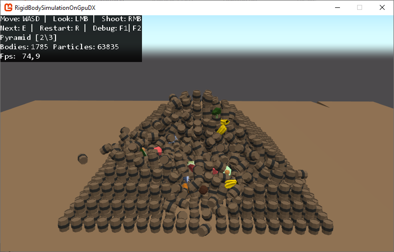

# 📦 Real-Time Rigid Body Simulation on GPUs

## 🌐 Translations

| Language  | Link |
|---|---|
| 🇷🇺 Русский  | [Readme.md](docs/ru/Readme.md) |
| 🇬🇧 English | [Readme.md](Readme.md) |

---

## Simulation

Loading the GIF... may take a few seconds ⏳  
  
  
[Watch Demo (Download MP4)](https://github.com/Bletraut/RigidBodySimulationOnGpuDX/raw/refs/heads/master/docs/content/Simulation.mp4)  

## Project Description

This project is a rigid body simulation implemented using **MonoGame** and **GPU computations**.  
The simulation is based on Chapter 29 from the book *GPU Gems 3*: [Chapter 29. Real-Time Rigid Body Simulation on GPUs](https://developer.nvidia.com/gpugems/gpugems3/part-v-physics-simulation/chapter-29-real-time-rigid-body-simulation-gpus). The main goal of the project was to recreate the methods described in the article and understand their underlying principles.  

The project uses the following 3D models: [Low Poly Food Pack by Felipe Greboge](https://greboge.itch.io/low-poly-food-pack).

### Features:
✅ Support for rigid bodies composed of particles  
✅ Simulation of elastic collisions  
✅ Simulation of friction and viscous damping  
✅ Simulation performed on the GPU for high performance

---

## 🚀 How It Works?

A more detailed explanation, including descriptions of shaders and techniques used, can be found [here](docs/en/HowItWorks.md).  

The system consists of a set of bodies, each of which is a collection of particles. Motion is calculated taking into account elastic forces, damping, and friction. Each body has:

- Center of mass
- Linear velocity
- Angular velocity
- Inertia tensor

Forces are calculated at the particle level and then aggregated into forces and torques for the entire body.

---

## 📂 Project Structure

Below is a description of the main classes:

```
├── RigidBodySimulationOnGpuDX/
│   ├── Simulation/
│   │   ├── ParticleShapeCreator.cs         # Class that converts a 3D model into a set of particles
│   │   ├── PhysicsOnGpuSolver.cs           # Class responsible for calculating the simulation
│   │   ├── PhysicsOnGpuSolver.Simulation.cs # Simulation logic (shader switching, etc.)
│   │   ├── PhysicsOnGpuSolver.Body.cs      # Logic for adding bodies
│   │   └── PhysicsOnGpuSolver.Render.cs    # Simulation rendering
│   ├── Program.cs                          # Program entry point
│   └── Simulation.cs                       # Simulation entry point
│
└── Content/Effects/
    ├── DepthPeeling.hlsl               # Determines particle positions for shape generation
    ├── ParticleValues.hlsl             # Calculates relative positions and forces for particles
    ├── GridGeneration.hlsl             # Generates a grid for collision optimization
    ├── CollisionReaction.hlsl          # Calculates collision reactions
    ├── BodiesValue.hlsl                # Calculates positions and impulses for rigid bodies
    ├── ParticleDebugRender.hlsl        # Renders particles (used for debugging)
    ├── SimulationRender.hlsl           # Renders bodies
    └── Skybox.hlsl                     # A simple skybox shader

```

---

## 🛠️ Technologies Used

This project runs on [MonoGame](https://monogame.net/) using DirectX, so it will definitely work on Windows but is unlikely to work on Mac or Linux (I haven’t tested it).

- .NET Core 8
- [MonoGame](https://monogame.net/)
- HLSL for shaders
- C# for simulation logic

For shader debugging, I used [RenderDoc](https://github.com/baldurk/renderdoc).

---

## 📖 How to Run

1. Clone the repository.
2. Install the .NET 8 SDK.
3. Open the solution in Visual Studio or Rider; MonoGame should install automatically via NuGet.
4. Run the project.
