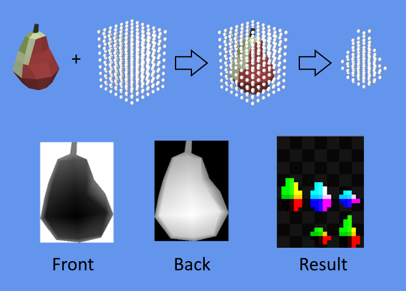
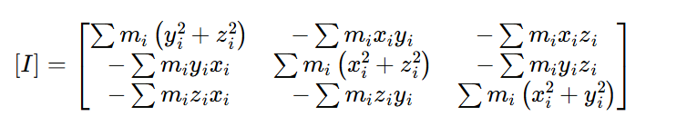

# 🚀 How It Works?

## 🌐 Translations

| Language  | Link |
|---|---|
| 🇷🇺 Русский  | [Readme.md](../ru/HowItWorks.md) |
| 🇬🇧 English | [Readme.md](HowItWorks.md) |

---

## 🏗️ What Does the Simulation Consist Of?

This simulation is based on Chapter 29 of *GPU Gems 3*: [Chapter 29. Real-Time Rigid Body Simulation on GPUs](https://developer.nvidia.com/gpugems/gpugems3/part-v-physics-simulation/chapter-29-real-time-rigid-body-simulation-gpus), with some modifications that will be described below.  
The main goal of the project is to recreate the methods used in the article and understand their principles. I deliberately avoided using modern GPU capabilities such as compute shaders (which, by the way, are not supported in the main branch of **MonoGame** at the moment 🐌), writing to 3D texture slices, etc. This was done to stay as close as possible to the technologies used in the article and to experience the spirit of that era, when information was not as widely available, and programming for GPUs felt like magic.

## 🏗️ What Does the Simulation Consist Of?

To understand how to perform the simulation on the GPU, let’s first break down how to do it on the CPU. Typically, a physics simulation involves solving three main tasks: calculating the motion and positions of rigid bodies, detecting collisions between rigid bodies, and calculating the reactions to those collisions.

First, let’s decide how bodies will be represented in the simulation. We define that the geometry of all bodies is represented by a 3D mesh that remains unchanged over time. Each body has a center of mass and an orientation in space, represented by a quaternion. All translations and rotations of the rigid body occur relative to its center of mass.

Next, we need to consider how collisions between rigid bodies will be detected. One approach is to represent a rigid body as a set of particles (which, by the way, is well-suited for parallel computations, making it very convenient for GPU calculations). All particles are spheres of the same size, effectively "voxelizing" the body. To detect collisions, we simply need to detect a collision between particles, which is very simple to do - particles collide if the distance between them is less than the sum of their radii.

Here’s how a rigid body is represented as a set of particles:

  
*The image shows a low-poly mango model voxelized with particles of the same size. The smaller the particle diameter, the higher the level of detail. Figure **a** shows the original model, while **b**, **c**, and **d** show voxelization with progressively increasing particle diameters.*

Since all collisions in our system occur between particles, the collision reactions will also be calculated between particles and then aggregated for the rigid body to which those particles belong.

Thus, to create a physics simulation, we need to perform the following steps:
1. Represent physical bodies as sets of particles.
2. Determine which particles collide.
3. Calculate collision reactions between particles.
4. Calculate the positions and orientations of rigid bodies in space based on the forces applied to the particles.

Repeat steps 2–4 to update the simulation. Each step will be discussed in more detail below.

---

## 🔵📦 Representing a Rigid Body as a Set of Particles

  

To represent a rigid body as a set of particles, imagine placing it inside a 3D grid of spheres (as shown in the image above). Each such sphere is called a voxel, and all we need to do is determine whether a voxel is inside the 3D model or not.

These calculations can be performed directly on the GPU to obtain the result. To do this, we need to acquire two depth buffers—one showing the model from the front (*Front* in the image) and the other showing it from the back (*Back* in the image). Using these depth values and the voxel’s coordinates, we can determine whether the voxel is inside the model by simply comparing the depth values from these buffers with the voxel’s Z-coordinate.

This technique is called *Depth Peeling*. You can find details of its implementation in the shader [DepthPeeling.fx](../../RigidBodySimulationOnGpuDX/Content/Effects/DepthPeeling.fx) and the class [ParticleShapeCreator.cs](../../RigidBodySimulationOnGpuDX/Simulation/ParticleShapeCreator.cs). The result of the shader’s work should be a 2D texture storing the positions of all particles. This texture is divided into sections of equal size in the shader, with the width and height corresponding to the number of particles along the X and Y axes, and the number of sections equal to the number of particles along the Z axis. In the original article, this technique is referred to as a *flat 3D texture*, and it will be used multiple times in this project.

It’s worth noting that the *Depth Peeling* technique implemented in this project is highly simplified, as we only obtain two depth slices—front and back. This implementation does not account for the possibility of cavities inside the bodies, such as those found in a teapot.

## 🎯 Detecting Collisions Between Particles

As mentioned earlier, detecting collisions between spherical particles is straightforward—if the distance between particles is less than the sum of their radii. Since all particles in our case have the same radius, we’ll use the particle diameter in the calculations.

This sounds simple, but there’s a catch: if we check every particle against every other particle, the complexity becomes n². For 100,000 particles, this isn’t very performant. This implementation does not use the typical broad and narrow phases for collision detection. Instead, to address this issue, we’ll optimize by dividing the entire simulation space into a 3D grid, where each voxel has a size equal to the particle diameter. Before checking for collisions, we need to iterate over all particles and record their indices in the voxel they belong to. Then, during collision detection, we find the voxel a particle belongs to, as well as the voxels of all its neighbors, and check for collisions only with particles in those voxels. As a result, for each particle, we only need to check 27 voxels (the particle’s voxel plus its neighbors), which is much better than n².

We’ll return to the GPU implementation of this method later, but for now, let’s assume we already have such a grid.

## 💥 Calculating Collision Reactions Between Particles

Before calculating collision reactions, we need to update the forces acting on the particles. To do this, we need to understand the forces acting on a rigid body. Fortunately, in this example, there are only two forces: linear momentum and angular velocity.

### 🔄 Updating Particle Velocities

You can find all the equations in the original article, but I’ll provide a simple pseudocode here. The complete implementation of particle velocity updates can be found in the shader [ParticleValues.fx](../../RigidBodySimulationOnGpuDX/Content/Effects/ParticleValues.fx).

```csharp
foreach (var particle in particles)
{
        var body = particle.Body;
        var relativePosition = body.RotationQuaternion * particle.Position;

        var linearVelocity = body.LinearMomentum / body.Mass;
        var angularVelocity = Vector3.Cross(body.AngularVelocity * relativePosition);

        particle.Velocity = linearVelocity + angularVelocity;
        particle.WorldPosition = body.Position + relativePosition;
}
```
*where `particle.Position` is the position of the particle relative to the center of mass*

The velocity of a particle is the sum of the body’s linear velocity and the cross product of the angular velocity and the particle’s relative position in space.

### ⚖️ Calculating Reaction Forces for Particles

Now that we have the particles’ velocities and their positions in space, it’s time to calculate the reaction force. This force consists of three components: the elastic force (which pushes particles apart), the damping force (which reduces velocity upon collision), and the shear force (which models friction between particles and is proportional to the relative tangential velocity). The complete implementation can be found in the shader [CollisionReaction.fx](../../RigidBodySimulationOnGpuDX/Content/Effects/CollisionReaction.fx).  

Let's see a pseudocode  
```csharp
void ComputeReactionForce(Particle p1, Particle p2)
{
    Vector3 relativePosition = p2.Position - p1.Position;
    Vector3 relativeVelocity = p2.Velocity - p1.Velocity;
    
    float distance = Vector3.Distance(relativePosition);
    if (distance >= p1.Diameter)
        return;
    
    Vector3 direction = normalize(relativePosition);
    Vector3 relativeTangentialVelocity = relativeVelocity - Vector3.Dot(relativeVelocity, direction) * direction;
    
    Vector3 springForce = -k * (p1.Diameter - distance) * direction;
    Vector3 dampingForce = n * relativeVelocity;
    Vector3 shearForce = kt * relativeTangentialVelocity;
    
    particle.Force += springForce + dampingForce + shearForce;
}

foreach (var particle in particles)
{
        var adjacentParticles = partile.GetVoxel().GetAdjacentParticles();
        foreach (var adjacentParticle in adjacentParticles)
        {
                ComputeReactionForce(particle, adjacentParticle);
        }
}
```
*where `-k` is the elasticity coefficient, `n` is the damping coefficient, and `kt` is the tangential stiffness coefficient.*

For each particle, we need to find all its neighbors and calculate the sum of the reaction forces between the particle and all its neighbors.

## 📍🌀 Calculating Positions and Orientations of Rigid Bodies in Space

This is arguably the most complex part of the entire simulation, as it involves many equations. The complete implementation can be found in the shader [BodiesValues.fx](../../RigidBodySimulationOnGpuDX/Content/Effects/BodiesValues.fx).  

### 📍 Updating the Position of a Rigid Body

Updating the position is relatively straightforward to implement, as it’s simply *`old_position += velocity * deltaTime`*. Let’s look at a simple pseudocode:
```csharp
Vector3 linearForce = Vector3.Zero;

foreach (var particle in body.Particles)
        linearForce += particle.Force;

linearForce += float3(0, Gravity, 0);

body.LinearMomentum += linearForce * deltaTime;
Vector3 velocity = body.LinearMomentum / body.Mass;

body.Position += velocity * deltaTime;
```

This is quite simple: to find the linear momentum acting on the body, we first need to calculate the force acting on the body. To do this, we sum the forces of all particles belonging to the rigid body. We also don’t forget to add gravity!

Next, we update the linear momentum of the rigid body, calculate the velocity from the linear momentum, and update the position.

### 🌀 Calculating the Inertia Tensor

Before calculating the orientation quaternion in space, we need to compute the inverse inertia tensor `I(0)⁻¹`, which will be used in the calculations. The inertia tensor is a 3x3 matrix that describes how the mass is distributed in the body relative to the axes of rotation. The larger the tensor elements, the harder it is for the body to rotate around the corresponding axes.

Since all bodies in this project are represented as sets of particles, we can use the formula for calculating the inertia tensor for point masses, sourced [here](https://brainly.com/topic/physics/tensor-of-inertia). The inertia tensor can be obtained by summing the moments of inertia of each point mass. The implementation can be found in the class [PhysicsOnGpuSolver.Body.cs](../../RigidBodySimulationOnGpuDX/Simulation/PhysicsOnGpuSolver.Body.cs).



Let's take a closer look at the tensor calculation code.  
```csharp
private Matrix CalculateInverseInertiaTensor(float mass, Vector3[] positions)
{
        var particleMass = mass / positions.Length;

        var tensor = new Matrix();
        foreach (var (x, y, z) in positions)
        {
                tensor.M11 += particleMass * (y * y + z * z);
                tensor.M12 -= particleMass * x * y;
                tensor.M13 -= particleMass * x * z;
                tensor.M21 -= particleMass * y * x;
                tensor.M22 += particleMass * (x * x + z * z);
                tensor.M23 -= particleMass * y * z;
                tensor.M31 -= particleMass * z * x;
                tensor.M32 -= particleMass * z * y;
                tensor.M33 += particleMass * (x * x + y * y);
        }
        tensor.M44 = 1;

        if (tensor.M11 == 0) tensor.M11 += (float)1e+6;
        if (tensor.M22 == 0) tensor.M22 += (float)1e+6;
        if (tensor.M33 == 0) tensor.M33 += (float)1e+6;

        Matrix.Invert(ref tensor, out var inverseTensor);

        return inverseTensor;
}
```

The first thing to note is that C# does not have a built-in type for a 3x3 matrix (although such a type exists in SharpDX, which this project uses, I chose not to use it to demonstrate an alternative approach). To obtain a 3x3 matrix—and, more importantly, its inverse—we can use a standard 4x4 matrix (Matrix in **MonoGame** or Matrix4x4 in **System.Numerics**) and fill it with zeros, setting the last diagonal element to 1. Then, we compute the inverse of the 4x4 matrix and extract the 3x3 matrix from it. In this project, the 3x3 matrix is extracted directly in the shader, but this isn’t the best approach because the constant buffer will contain unnecessary data that just takes up space. It would be much better to pass a 3x3 matrix directly to the shader.

The second thing to consider is that since the body is represented as a set of point masses, it’s possible for a tensor element along one of the axes to be 0—for example, if all the body’s particles are aligned along a single vertical line. In such cases, we get a degenerate tensor and cannot compute its inverse. To prevent this, we add a very large number to the diagonal element if it is 0. Since the inertia tensor represents resistance to rotation around the axes, adding a large number means the object cannot rotate around that axis because there is no moment of inertia, which is physically correct.  

### 🔃 Updating the Orientation of a Rigid Body in Space

Let's look at the pseudocode right away

```csharp
Vector3 angularForce = Vector3.Zero;

foreach (var particle in body.Particles)
        angularForce += Vector3.Cross(particle.RelativePosition, particle.Force);

Matrix3x3 rotationMatrix = Quaternion.ToMatrix(body.RotationQuaternion);

Matrix3x3 inverseInertiaTensorAtTime = rotationMatrix * inverseInertiaTensor * Matrix3х3.Transpose(rotationMatrix);
body.AngularMomentum += angularForce * deltaTime;
body.AngularVelocity = inverseInertiaTensorAtTime * body.AngularMomentum;

float theta = Vector3.Distance(body.AngularVelocity) * deltaTime;
Vector3 rotationAxis = Vector3.Distance(body.AngularVelocity) > 0 ? Vector3.Normalize(body.AngularVelocity) : Vector3.Zero;
Vector4 quaternionAtTime = new Vector4(rotationAxis * sin(theta / 2), cos(theta / 2));
body.RotationQuaternion = Quaternion.Multiply(quaternionAtTime, body.RotationQuaternion);
```

First, we need to iterate over all particles belonging to the rigid body to calculate the torque. Then, the inertia tensor is transformed into world coordinates (since it is initially defined in the body’s local coordinates) by multiplying it by the rotation matrix. Next, we update the angular momentum and calculate the angular velocity. After that, we compute the rotation increment using a quaternion by transforming the angular velocity. Finally, we calculate the new rotation quaternion.

# 🎮⚡ GPU Implementation

The main difference in the GPU implementation is the method of storing and updating data. Since this project does not use compute shaders or **RWStructuredBuffer** (which allows writing to arbitrary locations using the GPU), we have to use 2D textures to store and update data. These textures allow storing 32-bit float values (I used **SurfaceFormat.Vector4**, but for storing indices, you could reduce the number of bits per channel to save memory).

The essence of the GPU implementation is simple. All data for rigid bodies and particles must be stored in textures. If a parameter of a rigid body (such as position, rotation quaternion, linear momentum, or angular velocity) is updated throughout the simulation based on its previous value, two textures are created for that parameter. The current value is read from the first texture, the new value is written to the second texture, and at the end of the iteration, these textures are swapped so the new value becomes the current one.

In this project, rigid bodies of different physical shapes and particle counts are used. To achieve this, I created an additional texture where the RGBA channels store information about the rigid body. The R channel stores the index of the first particle in the particle texture, the G channel stores the number of particles belonging to the body, the B channel stores the index of the inverse inertia tensor in the constant buffer, and the A channel stores the inverse mass, which is needed for physics calculations.  
Additionally, in the texture storing the positions of particles relative to the center of mass, the A channel (or W component) stores the index of the rigid body, so when updating particle parameters, we can retrieve the parameters of the rigid body.  
The implementation of buffer creation can be found in the class [PhysicsOnGpuSolver.Base.cs](../../RigidBodySimulationOnGpuDX/Simulation/PhysicsOnGpuSolver.Base.cs), and the creation of a rigid body and writing its data to textures can be found in the class [PhysicsOnGpuSolver.Body.cs](../../RigidBodySimulationOnGpuDX/Simulation/PhysicsOnGpuSolver.Body.cs) in the method **AddPendingBodies**.  

The simulation is launched in the **Update** method over several iterations. Iterations are necessary to increase the accuracy of the simulation—the more iterations, the more accurate the simulation, but the more computational power is required. It’s important to choose a number of iterations that ensures maximum performance while keeping the simulation stable (bodies shouldn’t fly apart at tremendous speeds or sink into each other).

The simulation itself consists of four steps that run sequentially. In each step, a specific shader is launched, performs the necessary calculations, and writes the results to the corresponding textures.  
The implementation can be found in the class [PhysicsOnGpuSolver.Simulation.cs](../../RigidBodySimulationOnGpuDX/Simulation/PhysicsOnGpuSolver.Simulation.cs).

## 🔃 Updating Particle Parameters

To update particle parameters, the shader [ParticleValues.fx](../../RigidBodySimulationOnGpuDX/Content/Effects/ParticleValues.fx) is launched. A full-screen rectangle is drawn, and the particle index is derived from the fragment’s UV coordinates to retrieve its position. The A channel (or W component) of the particle position texture stores the index of the rigid body, allowing us to read all the rigid body’s parameters (linear momentum, angular velocity, etc.) and apply them to the particle.

The shader’s output is written to two textures in a single pass using multiple render targets (MRT).

It’s worth noting that texture samplers are not used to retrieve data from textures. This is because we only need the raw pixel data, and there’s no need to use a texture sampler, which performs additional work (filtering, coordinate transformations, etc.).

## 🖧 Generating a Grid for Optimizing Collision Calculations

This step is handled by the shader [GridGeneration.fx](../../RigidBodySimulationOnGpuDX/Content/Effects/GridGeneration.fx). The grid generation principle is identical to the one in the original article, with no modifications. To avoid rewriting the original article, I’ll provide a brief description of the algorithm.

Since **MonoGame** supports shaders in **.fx** files, not just **HLSL**, we can modify the rendering pipeline state directly in the shader file, which I find very convenient. You can find the pipeline state values in the [MSDN documentation](https://learn.microsoft.com/en-us/windows/win32/direct3d9/effect-states#pixel-pipe-render-states).

This shader uses GPU instancing, where points (not triangles) are drawn as primitives. Each instance represents a single particle and contains its index. The grid is represented as a flat 3D texture, where each voxel (pixel) stores the indices of particles that fall into that voxel in its corresponding channels. Since the voxel size equals the particle diameter, the RGBA channels are sufficient to store up to 4 particles per voxel. This number is enough to ensure the simulation looks correct.

The grid generation process consists of four shader passes, where particle indices are sequentially written to the corresponding voxel channels.

In the first pass, the color mask is set to the R channel, and writing to the Z-buffer is enabled. It’s important to note that the Z-buffer stores the particle index, not depth. Since all particles are ordered (because we add bodies sequentially and the particles belonging to a body are written to the buffer sequentially), they can be written to different channels in sequence.

In the second and subsequent passes, the channel for writing is changed, and the Z-test is set to pass greater values. Writing to the stencil buffer is also enabled, with its value incremented by 1. Additionally, a stencil test is set to pass if the value in the stencil buffer is less than 1. Upon passing the stencil test, the stencil buffer value is incremented by 1. Before each pass, the stencil buffer must be cleared. This technique allows particles to be drawn sequentially into different channels because already-drawn particles will be culled by the Z-test, and subsequent particles will be discarded by the stencil buffer.

## 🔃 Updating Rigid Body Parameters

Rigid body parameters are updated by the shader [BodiesValues.fx](../../RigidBodySimulationOnGpuDX/Content/Effects/BodiesValues.fx). The principle is similar to updating particle parameters. A full-screen rectangle is drawn, and the rigid body index is derived from the fragment’s UV coordinates. Then, the forces of all particles belonging to the rigid body are summed, and the linear momentum, angular velocity, etc., are calculated.

The shader’s output is written to multiple textures in a single pass using multiple render targets (MRT).

# 🖼️ Rendering

All rendering is done through GPU instancing. When a new rigid body is added, a cache of instance data (indices of the rigid body in the data texture) is created based on the model’s hash. Then, in the vertex shader, the instance data is retrieved, and the rigid body’s parameters—position and rotation quaternion—are extracted from the corresponding textures. The model’s vertices are transformed using these parameters and rendered by the fragment shader.  
The implementation can be found in the class [PhysicsOnGpuSolver.Render.cs](../../RigidBodySimulationOnGpuDX/Simulation/PhysicsOnGpuSolver.Render.cs).

# 💭 Conclusion

Is it worth performing physics simulations of a small number of rigid bodies (up to 3,000 bodies, for example) on the GPU when there are plenty of physics engines that work fast enough on the CPU? I think it’s definitely not worth it, as modern physics engines provide much greater control over physics simulations and are much easier to use. However, if you need to simulate liquids, smoke, or cloth, which may consist of hundreds of thousands of particles, the CPU’s resources might not suffice, and the GPU can come to the rescue.

Is it worth using the physics simulation methods described above in modern projects and on modern GPUs? If the technologies you’re developing with don’t support compute shaders, then it might be worth it. However, it’s always better to use more modern and performant methods, such as compute shaders.