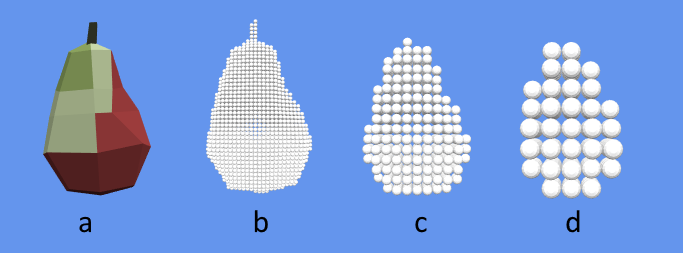
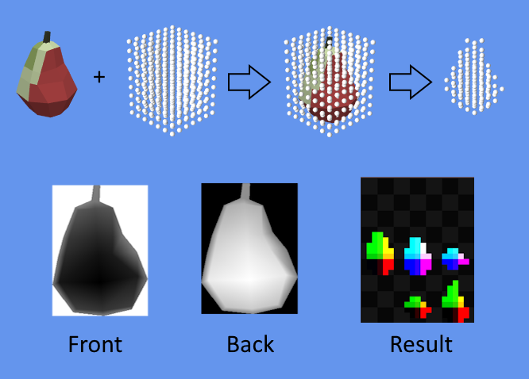
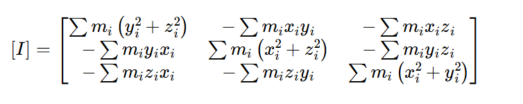

# 🚀 Как это работает?

## 🌐 Переводы

| Язык  | Ссылка |
|---|---|
| 🇷🇺 Русский  | [Readme.md](HowItWorks.md) |
| 🇬🇧 English | [Readme.md](../en/HowItWorks.md) |

---

Данная симуляция основана на главе 29 из книги Gpu Gems 3: [Chapter 29. Real-Time Rigid Body Simulation on GPUs](https://developer.nvidia.com/gpugems/gpugems3/part-v-physics-simulation/chapter-29-real-time-rigid-body-simulation-gpus) с некоторыми доработками, которые будут описаны ниже.  
Основная цель проекта - воссоздать методы используемые в данной статье и разобраться в принципах их работы. Я специально не использовал современные возможности видеокарты, такие как вычислительные шейдеры (к тому же на данный момент main ветка **Monogame** их не поддерживает 🐌), запись в срезы 3d текстур и т.д. Всё ради того, чтобы максимально приблизиться к технологиям используемым в статье и почувствовать дух того времени, когда информация не была так широко доступна и программирование для видеокарт было похоже на магию.

## 🏗️ Из чего состоит симуляция?

Чтобы понять как сделать симуляцию на GPU, давайте вначале разберемся как сделать её на CPU. Обычно в физической симуляции решаются три основных задачи: расчёт движений и позиций твёрдых тел, определение столкновений между твёрдыми телами и расчёт реакций на эти столкновения.  

Для начала решим как будут представлены тела в симуляции. Определим, что геометрия всех тел представлена трёхмерной сеткой, которая остаётся неизменной с течением времени. Каждое тело имеет центр масс, а также ориентацию в пространстве, которая представлена кватернионом. Все перемещения и вращения твердого тела происходят относительно центра масс.  

Теперь нужно подумать как будут определяться столкновения между твёрдыми телами. Одним из способов является представление твердого тела как набора частиц (ко всему прочему этот метод отличного подходит для параллельных вычислений, что делает его очень удобным для расчёта на графическом процессоре). Все частицы это обычные сферы одинакового размера, которыми как бы замощается тело. Для определения столкновений нам лишь нужно определить столкновение между частицами, что сделать очень просто - частицы сталкиваются если расстояние между ними меньше суммы их радиусов. 

Так выглядит представление твёрдого тела через частицы:

  
*На рисунке представлена низкополигональная модель манго, которая замощается частицами одинакового размера. Чем меньше диаметр частицы, тем выше уровень детализации. На рисунке **a** показана оригинальная модель, на **b**, **c** и **d** показано замощение частицами с постепенно увеличивающимся диаметром частиц.*

Поскольку все столкновения в нашей системе будут происходить между частицами, то и реакции на столкновения будут рассчитываться тоже между частицами, а потом агрегироваться на твёрдое тело к которому принадлежат эти частицы.  

Итак, чтобы у нас получилась физическая симуляция необходимо выполнить следующие шаги:
1. Представить физические тела как набор частиц.
2. Определить какие частицы сталкиваются.
3. Рассчитать реакции на столкновения между частицами.
4. Рассчитать позиции и ориентации в пространстве для твердых тел на основе сил приложенных к частицам.

Повторять пункты 2-4 для обновления симуляции. Ниже каждый пункт будет рассмотрен более подробно.

---

## 🔵📦 Представление твёрдого тела как набор частиц

  

Чтобы представить твёрдое тело в виде набора частиц, нужно представить что оно находится внутри трёхмерной сетки из шариков (как это показано на рисунке выше), каждый такой шарик называется вокселем и всё что нам нужно - это определить находится ли воксель внутри 3d модели или нет.  

Эти вычисления можно сразу сделать на видеокарте и получить результат. Для этого нам понадобится получить два буфера глубины - один показывает модель спереди (Front на рисунке), а второй показывает модель сзади (Back на рисунке). Имея эти значения глубины и координаты вокселя мы можем определить находится он внутри модели или нет просто сравнивая значения глубины из этих буферов с координатой Z вокселя.  

Данная техника называется *считыванием глубины* (Depth Peeling) детали реализации, которой можно посмотреть в шейдере [DepthPeeling.fx](../../RigidBodySimulationOnGpuDX/Content/Effects/DepthPeeling.fx) и классе [ParticleShapeCreator.cs](../../RigidBodySimulationOnGpuDX/Simulation/ParticleShapeCreator.cs). Результатом работы шейдера должна быть 2d текстура в которую записаны позиции всех частиц. Данная текстура в шейдере разбивается на участки одинакового размера, ширина и высота которых соответствует количеству частиц по оси X и Y, а число участков равно количеству частиц по оси Z. В оригинальной статье данная техника называется плоская 3d текстура и она ещё не раз нам пригодится в данном проекте.  

Стоит иметь в виду, что реализованная в данном проекте техника *считывания глубины* является очень упрощенной т.к. мы получаем всего лишь два среза глубины спереди и сзади. Данная реализация не учитывает то, что внутри тел могут быть отверстия, например, как в чайнике.

## 🎯 Определение столкновений между частицами

Как было сказано выше определить столкновения между частицами-сферами очень просто, если расстояние между частицами меньше суммы их радиусов. Поскольку в нашем случае все частицы имеют одинаковый радиус, то в расчётах будет использоваться диаметр частицы.  

Звучит просто, но есть один нюанс, если мы будем проверять на столкновения каждую частицу с каждой частицей, то получим сложность n². Для 100 000 частиц звучит не очень производительно. В данной реализации нет привычной широкой и узкой фазы для определения столкновений, вместо этого, чтобы решить проблему - сделаем небольшую оптимизацию разобьем всё пространство симуляции на трёхмерную сетку где каждый воксель имеет размер равный диаметру частицы. Перед началом проверки на столкновения необходимо пройтись по всем частицам и записать их индексы в воксель к которому они принадлежат. А затем во время обнаружения столкновений нужно найти воксель к которому принадлежит частица, а также воксели всех соседей и сделать проверку на столкновения только с частицами в этих вокселях. В итоге получится, что для каждой частицы нужно будет проверить всего лишь 27 вокселей (воксель самой частицы + соседи), звучит гораздо лучше, чем n².  

К реализации данного метода на GPU мы ещё вернемся, а пока просто представим, что уже имеем такую сетку.

## 💥 Расчёт реакций на столкновения между частицами

Прежде, чем рассчитывать реакции на столкновения нужно обновить силы, которые действуют на частицу. Для этого нужно разобраться какие силы действуют на твердое тело. К счастью в данном примере их всего две - линейный импульс и угловая скорость.  

### 🔄 Обновление скоростей частиц

Со всеми уравнениями можно ознакомиться в оригинальной статье, а я приведу лишь простой псевдокод. Готовую реализацию обновления скоростей частиц можно посмотреть в шейдере [ParticleValues.fx](../../RigidBodySimulationOnGpuDX/Content/Effects/ParticleValues.fx).

```csharp
foreach (var particle in particles)
{
        var body = particle.Body;
        var relativePosition = body.RotationQuaternion * particle.Position;

        var linearVelocity = body.LinearMomentum / body.Mass;
        var angularVelocity = Vector3.Cross(body.AngularVelocity * relativePosition);

        particle.Velocity = linearVelocity + angularVelocity;
        particle.WorldPosition = body.Position + relativePosition;
}
```
*где `particle.Position` это положение частицы относительно центра масс*

Скорость, которая будет у частицы складывается из линейной скорости самого тела и векторного произведения угловой скорости и относительного положения частицы в пространстве.  

### ⚖️ Расчёт сил реакций для частиц

Теперь имея скорости частиц, а также их положение в пространстве настало время рассчитать силу реакции. Она складывается из трёх составляющих: сила упругости (та самая сила, которая будет выталкивать частицы), сила демпфирования (гасит скорость при столкновении), а также сила сдвига (моделирует трение между частицами), которая пропорциональна относительной тангенциальной скорости. Готовую реализацию можно посмотреть в шейдере [CollisionReaction.fx](../../RigidBodySimulationOnGpuDX/Content/Effects/CollisionReaction.fx).  

Перейдем к псевдокоду  
```csharp
void ComputeReactionForce(Particle p1, Particle p2)
{
    Vector3 relativePosition = p2.Position - p1.Position;
    Vector3 relativeVelocity = p2.Velocity - p1.Velocity;
    
    float distance = Vector3.Distance(relativePosition);
    if (distance >= p1.Diameter)
        return;
    
    Vector3 direction = normalize(relativePosition);
    Vector3 relativeTangentialVelocity = relativeVelocity - Vector3.Dot(relativeVelocity, direction) * direction;
    
    Vector3 springForce = -k * (p1.Diameter - distance) * direction;
    Vector3 dampingForce = n * relativeVelocity;
    Vector3 shearForce = kt * relativeTangentialVelocity;
    
    particle.Force += springForce + dampingForce + shearForce;
}

foreach (var particle in particles)
{
        var adjacentParticles = partile.GetVoxel().GetAdjacentParticles();
        foreach (var adjacentParticle in adjacentParticles)
        {
                ComputeReactionForce(particle, adjacentParticle);
        }
}
```
*где `-k` коэффициент упругости, `n` коэффициент демпфирования, а `kt` коэффициент тангенциальной жесткости*  

Для каждой частицы необходимо найти всех её соседей и вычислить сумму сил реакций между частицей и всеми её соседями.

## 📍🌀 Расчёт позиций и ориентаций в пространстве для твёрдых тел

Пожалуй это самая сложная часть во всей симуляции так как в ней будет много формул. Готовую реализацию можно посмотреть в шейдере [BodiesValues.fx](../../RigidBodySimulationOnGpuDX/Content/Effects/BodiesValues.fx).    

### 📍 Обновление позиции твёрдого тела

Обновление позиции достаточно просто в реализации, т.к. это всего лишь *`старая_позиция += скорость * deltaTime`*. Посмотрим псевдокод  
```csharp
Vector3 linearForce = Vector3.Zero;

foreach (var particle in body.Particles)
        linearForce += particle.Force;

linearForce += float3(0, Gravity, 0);

body.LinearMomentum += linearForce * deltaTime;
Vector3 velocity = body.LinearMomentum / body.Mass;

body.Position += velocity * deltaTime;
```

Здесь всё предельно просто, чтобы найти линейный импульс, который действует на тело, вначале необходимо найти силу, которая действует на тело. Для этого нужно найти сумму сил всех частиц, принадлежащих твёрдому телу. Также не забудем добавить гравитацию!  

Далее обновляет линейный импульс для твёрдого тела, а из линейного импульса находим скорость и обновляем позицию.

### 🌀 Расчёт тензора инерции

Прежде, чем вычислить кватернион ориентации в пространстве необходимо вычислить обратный тензор инерции `I(0)⁻¹`, который будет использоваться в расчётах. Тензор инерции представляет собой матрицу 3х3 и описывает, как распределена масса в теле относительно осей вращения. Чем больше элементы тензора, тем сложнее телу вращаться вокруг соответствующих осей.  

Так как в данном проекте все тела представлены набором частиц, то мы можем использовать формулу для расчёта тензора инерции для точечных масс взятую [отсюда](https://brainly.com/topic/physics/tensor-of-inertia). Тензор инерции можно получить путем суммирования моментов инерции каждой точечной массы. Реализацию можно посмотреть в классе [PhysicsOnGpuSolver.Body.cs](../../RigidBodySimulationOnGpuDX/Simulation/PhysicsOnGpuSolver.Body.cs).  

  

Рассмотрим код расчёта тензора подробнее  
```csharp
private Matrix CalculateInverseInertiaTensor(float mass, Vector3[] positions)
{
        var particleMass = mass / positions.Length;

        var tensor = new Matrix();
        foreach (var (x, y, z) in positions)
        {
                tensor.M11 += particleMass * (y * y + z * z);
                tensor.M12 -= particleMass * x * y;
                tensor.M13 -= particleMass * x * z;
                tensor.M21 -= particleMass * y * x;
                tensor.M22 += particleMass * (x * x + z * z);
                tensor.M23 -= particleMass * y * z;
                tensor.M31 -= particleMass * z * x;
                tensor.M32 -= particleMass * z * y;
                tensor.M33 += particleMass * (x * x + y * y);
        }
        tensor.M44 = 1;

        if (tensor.M11 == 0) tensor.M11 += (float)1e+6;
        if (tensor.M22 == 0) tensor.M22 += (float)1e+6;
        if (tensor.M33 == 0) tensor.M33 += (float)1e+6;

        Matrix.Invert(ref tensor, out var inverseTensor);

        return inverseTensor;
}
```

Первый нюанс, который стоит учесть - в C# нет типа для матрицы размером 3х3 (он есть в SharpDX на котором работает этот проект, но я решил его не использовать чтобы показать другой способ). Чтобы получить матрицу 3х3, а самое главное её обратную матрицу, можно взять обычную матрицу 4х4 (Matrix в **Monogame** или Matrix4x4 в **System.Numerics**) и дополнить её нулями, а в последний диагональный элемент записать 1. Далее необходимо найти обратную матрицу 4х4 и извлечь из неё матрицу 3х3. В данном проекте матрица 3х3 извлекается сразу в шейдере, но это не очень хороший подход т.к. в константном буфере будут ненужные данные, которые только занимают место, гораздо лучше передать в шейдер сразу матрицу 3х3.  

Второй нюанс - т.к. тело представляет собой набор точечных масс, то может получиться так, что элемент тензора по одной из осей равен 0, например когда все частицы тела выстроены в одну вертикальную линию. В таком случае мы получаем вырожденный тензор и не сможем вычислить обратную матрицу. Чтобы этого не произошло необходимо добавить очень большое число к элементу на главной диагонали если он равен 0. Т.к. тензор инерции показывает сопротивление при вращении по осям, то при добавлении большого числа это будет означать, что объект не может вращаться по данной оси т.к. на ней отсутствует момент инерции, что физически абсолютно корректно.  

### 🔃 Обновление ориентации в пространстве твёрдого тела

Сразу посмотрим на псевдокод

```csharp
Vector3 angularForce = Vector3.Zero;

foreach (var particle in body.Particles)
        angularForce += Vector3.Cross(particle.RelativePosition, particle.Force);

Matrix3x3 rotationMatrix = Quaternion.ToMatrix(body.RotationQuaternion);

Matrix3x3 inverseInertiaTensorAtTime = rotationMatrix * inverseInertiaTensor * Matrix3х3.Transpose(rotationMatrix);
body.AngularMomentum += angularForce * deltaTime;
body.AngularVelocity = inverseInertiaTensorAtTime * body.AngularMomentum;

float theta = Vector3.Distance(body.AngularVelocity) * deltaTime;
Vector3 rotationAxis = Vector3.Distance(body.AngularVelocity) > 0 ? Vector3.Normalize(body.AngularVelocity) : Vector3.Zero;
Vector4 quaternionAtTime = new Vector4(rotationAxis * sin(theta / 2), cos(theta / 2));
body.RotationQuaternion = Quaternion.Multiply(quaternionAtTime, body.RotationQuaternion);
```

Для начала необходимо пройтись по всем частицам, которые принадлежат твёрдом телу, чтобы вычислить крутящий момент. Затем тензор инерции приводится к мировым координатам (т.к. он изначально задан в локальных координатах тела) путём умножения на матрицу поворота. Затем идёт обновление углового момента и вычисление угловой скорости. Далее вычисляется приращение вращения через кватернион путем преобразования угловой скорости. Наконец вычисляется новый кватернион поворота.

# 🎮⚡ Реализация на GPU

Основное отличие реализации на GPU это метод хранения и обновления данных. Так как в данном проекте не используются вычислительные шейдеры и **RWStructuredBuffer** (в который можно вести запись в произвольное место с помощью графического процессора), то для хранения и обновления данных придется использовать 2d текстуры, которые позволяют хранить float значения размером 32 бита (я использовал **SurfaceFormat.Vector4**, но для хранения индексов, возможно, уменьшить чисто бит на канал, чтобы уменьшить расход памяти).  

Суть реализации на GPU довольна проста - все данные твёрдого тела и частиц должны храниться в текстурах, а если параметр твёрдого тела будет обновляться в течении всей симуляции на основе предыдущего значения (позиция, кватернион поворота, линейный импульс, угловая скорость), то для такого параметра создается две текстуры. Из первой текстуры будет считываться текущее значение, а во вторую будет записываться новое значение, а в конце итерации эти текстуры будут меняться, чтобы новое значение стало текущим.  

В данном проекте используются твёрдые тела разной физической формы и с разным числом частиц. Для достижения этого эффекта пришлось создать дополнительную текстуру, в каналах RGBA которой хранится информация о твёрдом теле. В канале R хранится индекс первой частицы в текстуре с частицами, в канале G - количество частиц принадлежащих телу, в канале B - индекс на обратный тензор инерции в константном буфере, в канале A - хранится обратная масса, которая необходима для физических расчётов.  
Также в текстуре, хранящей положение частиц относительно центра масс, в канал A записывается индекс твёрдого тела, чтобы при обновлении параметров частиц мы могли получить параметры твердого тела.
Реализацию создания буферов можно посмотреть в классе [PhysicsOnGpuSolver.Base.cs](../../RigidBodySimulationOnGpuDX/Simulation/PhysicsOnGpuSolver.Base.cs), а создание твердого тела и запись его данных в текстуры в классе [PhysicsOnGpuSolver.Body.cs](../../RigidBodySimulationOnGpuDX/Simulation/PhysicsOnGpuSolver.Body.cs) в методе **AddPendingBodies**.  

Симуляция запускается методе **Update** в несколько итераций. Итерации нужны для увеличения точности симуляции, чем больше чисто итераций, тем точнее будет симуляция и тем больше потребуется вычислительной мощности. Важно подобрать такое число итераций, чтобы обеспечить максимальную производительность и в тоже время симуляция должна оставаться стабильной (тела не должны разлетаться с огромной скоростью или наоборот просачиваться).  

Сама симуляция состоит из четырех шагов, которые запускаются друг за другом. В каждом шаге запускается определенный шейдер, производит необходимые расчёты и записывает результаты в соответствующие текстуры.  
Реализацию можно посмотреть в классе [PhysicsOnGpuSolver.Simulation.cs](../../RigidBodySimulationOnGpuDX/Simulation/PhysicsOnGpuSolver.Simulation.cs).

## 🔃 Обновление параметров частиц

Для обновления параметров частиц запускается шейдер [ParticleValues.fx](../../RigidBodySimulationOnGpuDX/Content/Effects/ParticleValues.fx). Рисуется прямоугольник на весь экран, затем из UV координат фрагмента получается индекс частицы и берётся её позиция. В альфа канале текстуры позиций частиц (или компоненте W позиции) хранится индекс твёрдого тела, благодаря которому можно считать все параметры твёрдого тела (линейный импульс, угловую скорость и т.д.) и применить их к частице.  

Результат работы шейдера выводится сразу в две текстуры за один проход, используя несколько буферов для рендеринга (Multiple Render Targets).

Хочу отметить, что для получения данных из текстур не используются сэмплеры, всё потому что нам нужно получить только сырые данные пикселя и нет нужны использовать текстурный сэмплер, который проводит дополнительную работу (фильтрация, преобразование координат и т.д.).

## 🖧 Генерация сетки для оптимизации расчёта столкновений

За данный этап отвечает шейдер [GridGeneration.fx](../../RigidBodySimulationOnGpuDX/Content/Effects/GridGeneration.fx). Принцип генерации сетки точно такой же как в оригинальной статье без каких либо изменений. Дабы не переписывать исходную статью приведу лишь краткое описание алгоритма.

Поскольку **Monogame** поддерживает шейдеры в **.fx** файлах, а не просто файлы **hlsl**, мы можем менять состояние конвейера рендеринга непосредственно в файле с шейдерным кодом, что я нахожу очень удобным. Со значениями состояний конвейера можно ознакомиться в [справке MSDN](https://learn.microsoft.com/en-us/windows/win32/direct3d9/effect-states#pixel-pipe-render-states).  

Данный шейдер использует GPU-инстансинг, в котором в качестве примитивов отрисовываются точки, а не треугольники. Каждый инстанс представляет собой одну частицу и содержит её индекс. Сетка представляется из себя плоскую 3d текстуру в каждом вокселе (пикселе) которой, в соответствующих каналах содержатся индексы частиц, которые попали в этот воксель. Так как размер вокселя равен размеру диаметру частицы, то каналов RGBA достаточно для того чтобы хранить 4 частицы в вокселе. Данного количества достаточно для того чтобы симуляция выглядела корректно.  

Принцип генерации сетки состоит из четырех проходов шейдера где на каждом этапе последовательно записываются индексы частиц в соответствующие каналы вокселя.

В первом проходе цветовая маска устанавливается на канал R, а также включается запись в Z буфер. Важно уточнить, что в Z буфер записывается именно индекс частицы,поскольку все частицы упорядочены (потому что мы добавляем тела последовательно и частицы принадлежащие телу записываются в буфер тоже последовательно), то их возможно последовательно записать в разные каналы.

Во втором и последующих проходах меняется канал для записи, а также Z тест устанавливается на прохождение больших значений. Также включается запись в буфер трафарета и его увеличение на 1. Также устанавливается тест буфера трафарета если значение в буфере меньше 1. При успешном прохождении теста трафарета значение в буфере трафарета увеличивается на 1. Перед началом каждого прохода необходимо очищать буфер трафарета. Данная техника позволяет отрисовать частицы последовательно в разные каналы благодаря тому, что уже нарисованные частицы будет отсекать Z тест, а следующие будет отбрасывать буфер трафарета.

## 🔃 Обновление параметров твёрдых тел

Параметры твердых тел обновляются шейдером [BodiesValues.fx](../../RigidBodySimulationOnGpuDX/Content/Effects/BodiesValues.fx). Принцип работы аналогичен обновлению параметров для частиц. Рисуется прямоугольник на весь экран, затем из UV координат фрагмента получается индекс твёрдого тела, далее суммируются силы всех частиц принадлежащих твёрдому телу и рассчитываются линейный импульс, угловые скорости и т.д. 

Результат работы шейдера выводится сразу в несколько текстур за один проход, используя несколько буферов для рендеринга (Multiple Render Targets).

# 🖼️ Рендеринг

Весь рендеринг работает через GPU-инстансинг. Когда добавляется новое твёрдое тело, то для него по хэшу модели создается кэш с данными инстансов (индексы твердого тела в текстуре с данными). Далее в вершинном шейдере берутся данные инстанса и по ним из соответствующих текстур извлекаются параметры твердого тела - позиция и кватернион поворота. Вершины модели преобразуются с помощью полученных параметров и отрисовываются фрагментным шейдером.  
Реализацию можно посмотреть в классе [PhysicsOnGpuSolver.Render.cs](../../RigidBodySimulationOnGpuDX/Simulation/PhysicsOnGpuSolver.Render.cs).

# 💭 Заключение

Стоит ли вообще заниматься физической симуляцией небольшого количества твёрдых тел (возможно, до 3 000 тел) на GPU если есть куча физических движков, которые достаточно быстро работают на CPU? Я думаю, что определенно не стоит, т.к. современные физические движки предоставляют гораздо больший контроль на физической симуляцией и гораздо более простое использование. Однако, если вам понадобится симулировать жидкости, дым и ткани, которые могут состоять из сотен тысяч частиц, то тут уже ресурсов CPU может не хватить и на помощь вам придет GPU.  

Стоит ли использовать методы физической симуляции описанные выше в современных проектах и на современных GPU? Если технологии на которых вы разрабатываете не поддерживают вычислительные шейдеры, то скорее всего стоит. Однако, лучше всегда использовать более современные и производительные методы, например, вычислительные шейдеры.  